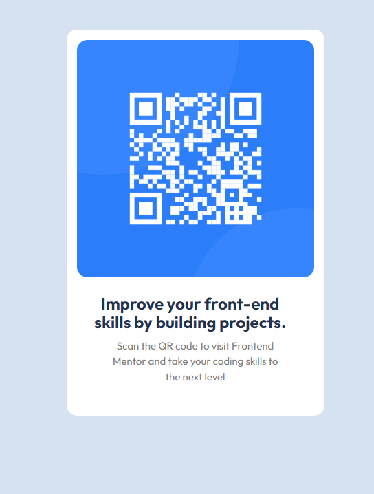

### Getting Set Up

This is a solution to the [QR code component challenge on Frontend Mentor](https://www.frontendmentor.io/challenges/qr-code-component-iux_sIO_H).

## Table of contents

- [Overview](#overview)
  - [Screenshot](#screenshot)
  - [Links](#links)
- [My process](#my-process)
  - [Built with](#built-with)
  - [What I learned](#what-i-learned)
  - [Continued development](#continued-development)
  - [Useful resources](#useful-resources)
- [Author](#author)
- [Acknowledgments](#acknowledgments)

## Overview

### Screenshot

### Links

- Solution URL: [https://ridge-runner.github.io/qr-code-component-main/](https://ridge-runner.github.io/qr-code-component-main/)

## My Process
Focused on using Grid and Flex Box in the positioning of the component.

### Built with

- Semantic HTML 5 markup (where possible)
- CSS custom properties
- CSS Grid
- CSS Flexbox

### What I learned

1. I got a better grasp on layout methods by combining Flex and Grid.
2. Sometimes, things are left out of the desgin system docs and you have to either improvise (or call someone.)
 
 ### Continued Development
 1. Keep working on Grip and Flex layouts.
 2. Choose a methodology (like BEM or Cube) to practice organizing CSS classes.

 ### Useful Resources

 - [Kevin Powell's Youtube Channel](https://www.youtube.com/@KevinPowell) - The guy's channel is a great resource for all things CSS.
 - [MDN](https://developer.mozilla.org/) - for obvious reasons. Now better since they've started including demos like W3 Schools.

 ## Author

I'm a longtime tech enthusiast, learning frontend web dev and low-level programming.

From Virginia in the USA.

- Frontend Mentor profile - [@yourusername](https://www.frontendmentor.io/profile/yourusername)
- Github

